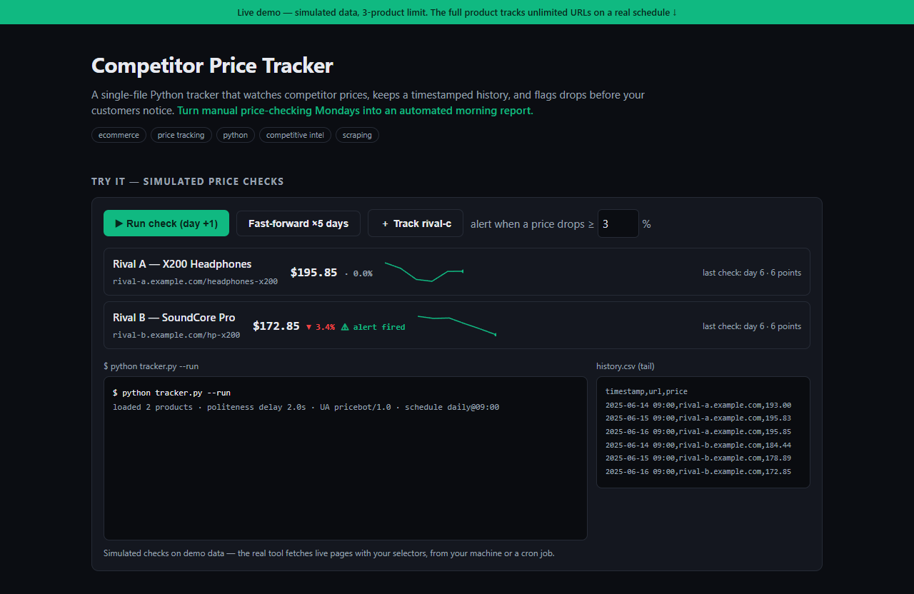

# Competitor Price Tracker — live demo

  

  <a href="https://amos-mig.github.io/competitor-price-tracker-demo/"><strong>▶ Open the live demo</strong></a> ·
  <a href="https://amosmign.gumroad.com/l/competitor-price-tracker"><strong>Get the full product · €29</strong></a>

## What this is

A working browser simulation of the Competitor Price Tracker: each simulated run fetches prices from three demo competitor products, appends timestamped rows to a CSV history with sparklines, and fires drop-threshold alerts in a live console log. Locked cards and a partial code preview show the rest — selector recipes, digests and webhooks — stays in the full kit.

**Try it:** Click 'Run check' a few times or 'Fast-forward ×5 days', then lower the alert threshold to 1% to watch drop alerts fire.

## What you get in the full product

- Tracks price changes on schedule across product lists
- Historical data for trend analysis (CSV/JSON output)
- Drop/threshold alerts ready for email or webhook integration
- Respectful crawling: configurable delays and user agent
- Single Python file — adapt selectors to your market in minutes

## About

- **Storefront:** [kits.amosmignery.dev](https://kits.amosmignery.dev) — single-file products, instant download, commercial license
- **Checkout:** [Gumroad](https://amosmign.gumroad.com/l/competitor-price-tracker) (Merchant of Record, VAT handled)
- **Full product:** [Competitor Price Tracker](https://amosmign.gumroad.com/l/competitor-price-tracker) · €29

## License

The demo page in this repo is MIT-licensed — reuse the technique, not the product.
The **Competitor Price Tracker** itself is not included here and is not free software.
